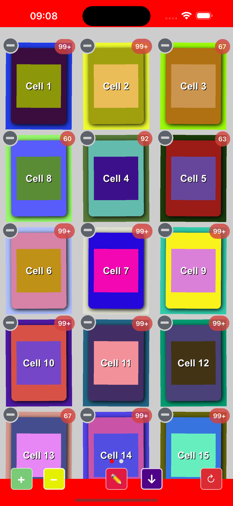
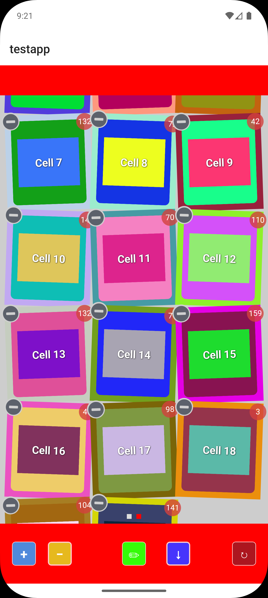

# de.marcbender.sortablegrid

SortableGridView (like iOS Dashboard) for Titanium.

## Features

- Drag-and-drop reordering with long press
- Edit mode with wobble animation and delete buttons
- Vertical and horizontal scrolling
- Grid and waterfall (Pinterest-style) layouts
- Badge support on items
- Paging with page indicator
- Pull-to-refresh

## Demo





## Quick Start

```javascript
var sortableGridModule = require('de.marcbender.sortablegrid');

var gridView = sortableGridModule.createView({
    columnCount: 3,
    minHorizontalSpacing: 10,
    minVerticalSpacing: 10,
    wobble: true,
    showDeleteButton: true,
    itemsBadgeEnabled: true
});

var items = [];
for (var i = 0; i < 12; i++) {
    var item = sortableGridModule.createItem({
        id: i + 1,
        height: Ti.UI.SIZE,
        width: Ti.UI.FILL,
        canBeDeleted: true,
        canBeMoved: true,
        badge: true,
        badgeValue: i * 5
    });
    item.add(Ti.UI.createLabel({
        text: 'Cell ' + (i + 1),
        backgroundColor: '#3498db',
        width: Ti.UI.FILL,
        height: 120,
        textAlign: Ti.UI.TEXT_ALIGNMENT_CENTER,
        color: '#fff'
    }));
    items.push(item);
}

gridView.data = items;
win.add(gridView);
```

## Feature Comparison: iOS vs Android

| Feature | iOS | Android |
|---------|:---:|:-------:|
| Vertical scrolling | ✅ | ✅ |
| Horizontal scrolling | ✅ | ✅ |
| Column count | ✅ | ✅ |
| Row count (horizontal) | ✅ | ✅ |
| Waterfall / staggered layout | ✅ | ✅ |
| Min horizontal / vertical spacing | ✅ | ✅ |
| Content insets | ✅ | ✅ |
| Disable bounce | ✅ | ✅ |
| Paging enabled | ✅ | ✅ |
| Page indicator (pager) | ✅ | ✅ |
| Pager follows bottom inset | ✅ | ✅ |
| Start / stop editing | ✅ | ✅ |
| Wobble animation | ✅ | ✅ |
| Delete button | ✅ | ✅ |
| Custom delete button image | ✅ | ✅ |
| Drag to reorder | ✅ | ✅ |
| `canBeDeleted` per item | ✅ | ✅ |
| `canBeMoved` per item | ✅ | ✅ |
| Badge display | ✅ | ✅ |
| Badge value | ✅ | ✅ |
| Badge tint color | ✅ | ✅ |
| Badge visible in edit mode | ✅ | ✅ |
| Update badge at runtime | ✅ | ✅ |
| `insertItemAtIndex` | ✅ | ✅ |
| `deleteItemAtIndex` | ✅ | ✅ |
| Set / clear / re-add data | ✅ | ✅ |
| `scrollToItemAtIndex` | ✅ | ✅ |
| `scrollToBottom` / `scrollToTop` | ✅ | ✅ |
| Pull-to-refresh | ✅ | ✅ |
| Scroll events | ✅ | ✅ |
| Page change events | ✅ | ✅ |

See [full documentation](documentation/index.md) for complete API reference.

## Requirements

- iOS 12.0+
- Android API 21+

## Authors

- Marc Bender ([@mbender74](https://github.com/mbender74/))